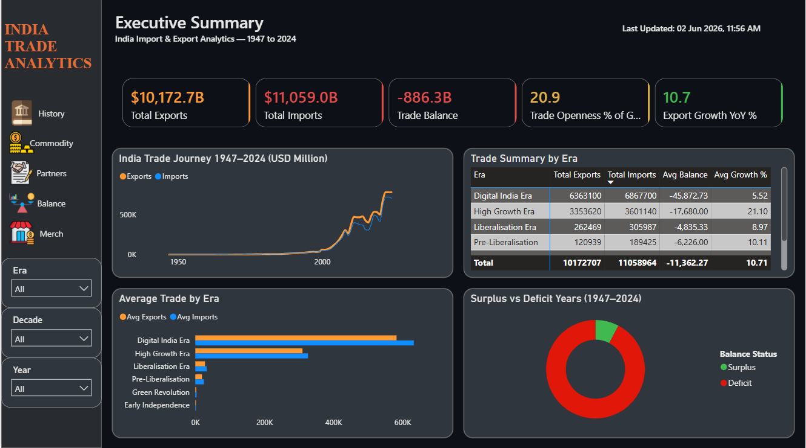
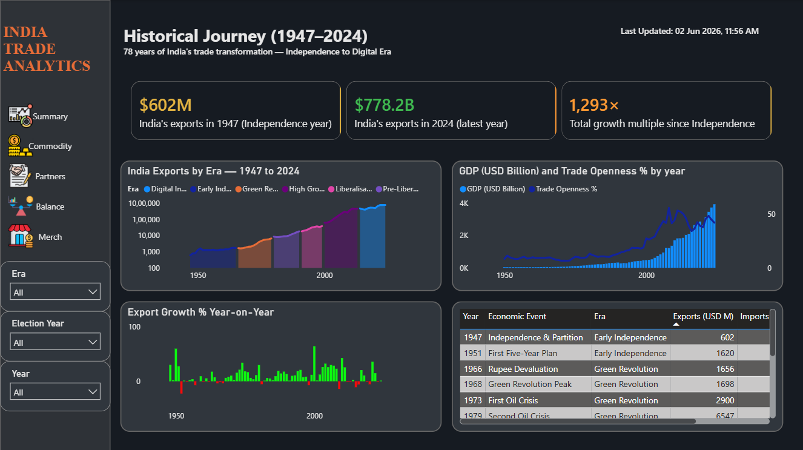
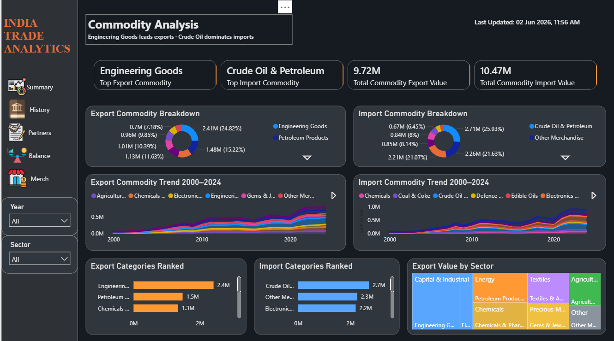
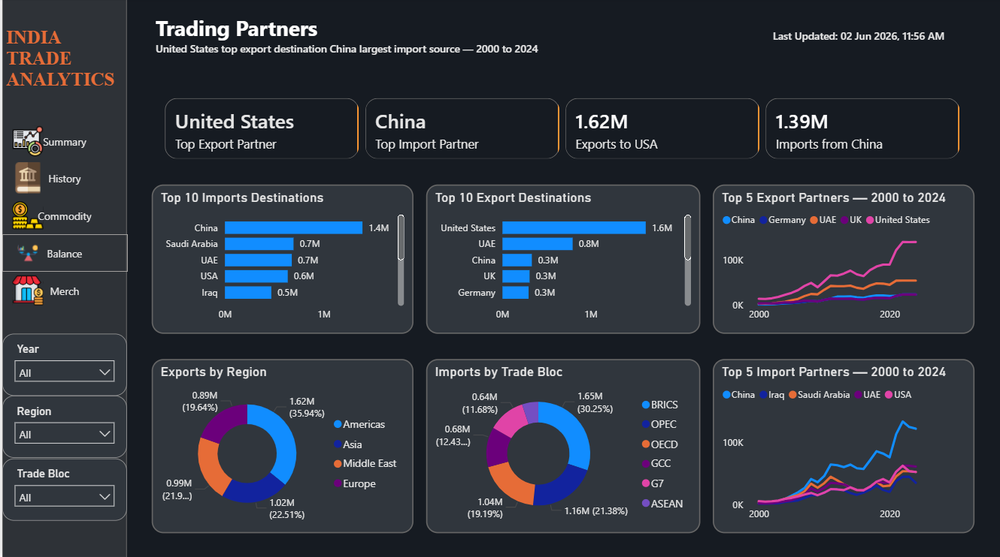
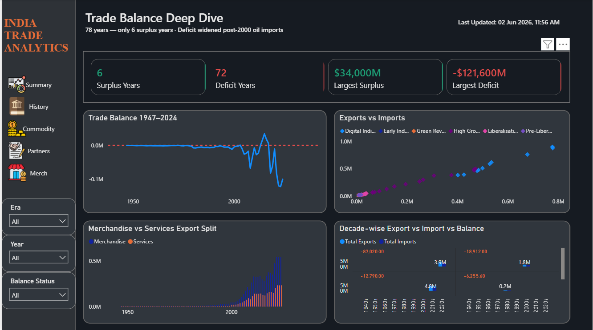
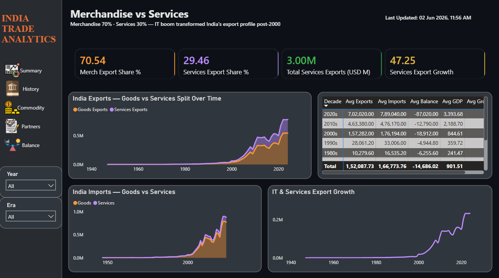

# 🇮🇳 India Trade Analytics Dashboard


An end-to-end **Trade Analytics** project built on India's import/export data, featuring a SQL Server star schema data warehouse and a multi-page Power BI dashboard.

---

## 📊 Dashboard Preview

<table>
  <tr>
    <td></td>
    <td></td>
    <td></td>
  </tr>
  <tr>
    <td></td>
    <td></td>
    <td></td>
  </tr>
</table>

---

## 🎯 Objective

To analyze India's trade performance across commodities, trading partners, and time periods by building a structured data warehouse and interactive Power BI dashboards that surface actionable insights from raw trade data.

---

## 🗂️ Project Structure

```
India Trade/
│
├── 📁 database/
│   ├── 01_database_creation.sql          # Database setup
│   │
│   ├── 📁 dimensions/
│   │   ├── 02_dim_date.sql               # Date dimension table
│   │   ├── 03_dim_commodity.sql          # Commodity dimension table
│   │   └── 04_dim_trading_partner.sql    # Trading partner dimension table
│   │
│   ├── 📁 facts/
│   │   ├── 05_fact_annual_trade.sql      # Annual trade fact table
│   │   ├── 06_fact_commodity_trade.sql   # Commodity-level trade fact table
│   │   └── 07_fact_partner_trade.sql     # Partner-level trade fact table
│   │
│   ├── 📁 views/
│   │   ├── 08_vw_trade_summary.sql       # Overall trade summary view
│   │   ├── 09_vw_commodity_exports.sql   # Commodity exports view
│   │   ├── 10_vw_commodity_imports.sql   # Commodity imports view
│   │   ├── 11_vw_partner_exports.sql     # Partner-wise exports view
│   │   ├── 12_vw_partner_imports.sql     # Partner-wise imports view
│   │   └── 13_vw_decade_summary.sql      # Decade-level trend view
│   │
│   └── 📁 validation/
│       └── 14_data_validation.sql        # Data quality checks
│
├── 📁 images/                            # Dashboard screenshots
│   ├── img_1.png
│   ├── img_2.png
│   ├── img_3.png
│   ├── img_4.png
│   ├── img_5.png
│   └── img_6.png
│
├── 📁 main_dataset/                      # Raw source data (CSV)
│
└── india_trade.pbix                      # Power BI report file
```

---

## 🏗️ Data Architecture

This project follows a **Star Schema** design pattern optimized for analytical queries.

```
                    ┌──────────────────┐
                    │   Dim_Date       │
                    │  (02_dim_date)   │
                    └────────┬─────────┘
                             │
┌──────────────────┐         │         ┌──────────────────────┐
│  Dim_Commodity   ├─────────┼─────────┤  Dim_TradingPartner  │
│ (03_dim_commod.) │    ┌────▼────┐    │  (04_dim_trading..)  │
└──────────────────┘    │  FACT   │    └──────────────────────┘
                        │ Tables  │
                        └─────────┘
                    Fact_AnnualTrade
                    Fact_CommodityTrade
                    Fact_PartnerTrade
```

---

## 🗄️ Database Objects

### Dimension Tables
| Table | Description |
|-------|-------------|
| `Dim_Date` | Calendar hierarchy — year, quarter, month, decade |
| `Dim_Commodity` | Commodity categories and HS code groupings |
| `Dim_TradingPartner` | Country details including region and continent |

### Fact Tables
| Table | Description |
|-------|-------------|
| `Fact_AnnualTrade` | Year-level aggregated trade values (exports & imports) |
| `Fact_CommodityTrade` | Commodity-wise trade volumes and values |
| `Fact_PartnerTrade` | Partner country-wise trade flows |

### Analytical Views
| View | Description |
|------|-------------|
| `vw_trade_summary` | High-level trade balance overview |
| `vw_commodity_exports` | Top commodities by export value |
| `vw_commodity_imports` | Top commodities by import value |
| `vw_partner_exports` | Country-wise export breakdown |
| `vw_partner_imports` | Country-wise import breakdown |
| `vw_decade_summary` | Long-term decadal trade trends |

---

## 📈 Dashboard Pages

The Power BI report (`india_trade.pbix`) includes the following pages:

1. **Trade Overview** — High-level KPIs: total exports, imports, trade balance, and YoY growth
2. **Commodity Analysis** — Top exported/imported commodities with trend lines
3. **Trading Partner Analysis** — Country and region-level trade breakdown
4. **Time Trends** — Year-over-year and decade-over-decade trade patterns
5. **Export Deep Dive** — Commodity × Partner matrix for exports
6. **Import Deep Dive** — Commodity × Partner matrix for imports

---

## 🛠️ Tech Stack

| Layer | Tool |
|-------|------|
| Data Warehouse | Microsoft SQL Server |
| Data Modeling | Star Schema (3NF Dimensions + Fact Tables) |
| Visualization | Power BI Desktop |
| Query Language | T-SQL |
| Version Control | Git / GitHub |

---

## 🚀 How to Run

### 1. Set Up the Database
Execute the SQL scripts in order:

```sql
-- Step 1: Create the database
01_database_creation.sql

-- Step 2: Create dimension tables
02_dim_date.sql
03_dim_commodity.sql
04_dim_trading_partner.sql

-- Step 3: Create fact tables
05_fact_annual_trade.sql
06_fact_commodity_trade.sql
07_fact_partner_trade.sql

-- Step 4: Create analytical views
08_vw_trade_summary.sql  →  13_vw_decade_summary.sql

-- Step 5: Run validation
14_data_validation.sql
```

### 2. Load the Dataset
Place the raw CSV files from `main_dataset/` into SQL Server using BULK INSERT or SQL Server Import Wizard.

### 3. Open Power BI Report
Open `india_trade.pbix` in Power BI Desktop and update the data source connection to your SQL Server instance.

---

## 🔍 Key Insights (Sample)

- 📦 **Top Export Commodity**: Engineering goods & petroleum products consistently lead exports
- 🌍 **Top Trading Partner**: USA, China, and UAE dominate trade flows
- 📉 **Trade Balance**: India maintains a trade deficit driven by crude oil and electronics imports
- 📅 **Decade Trend**: Exports grew ~3x from 2000s to 2020s; imports grew ~4x in the same period

---

## 👤 Author

**Yuvaraj M**
Data Analyst | SQL Server · Power BI · DAX

[](https://iamyuvaraj.site)
[](https://github.com/yuvarajm-uv)
[](https://linkedin.com/in/yuvarajm-uv)

---

## 📄 License

This project is open source and available under the [MIT License](LICENSE).
